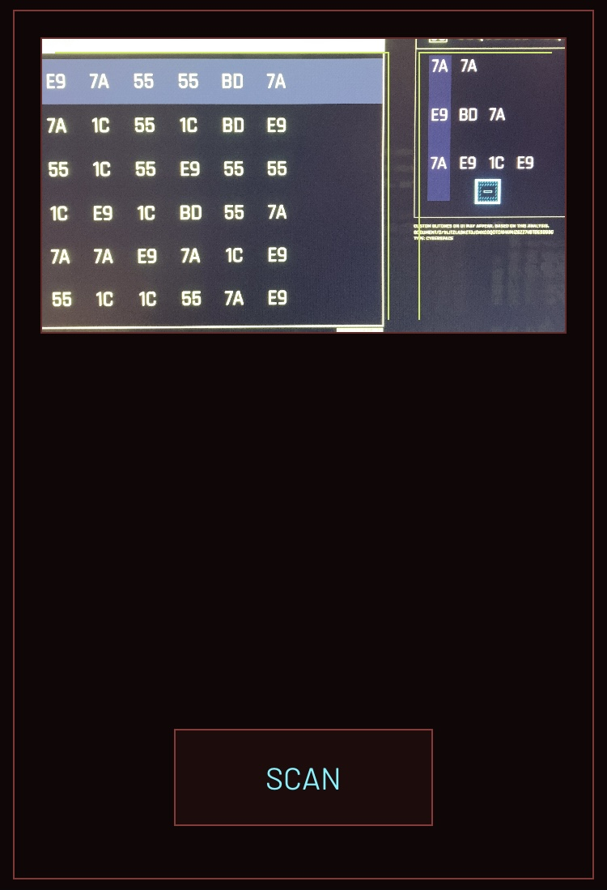
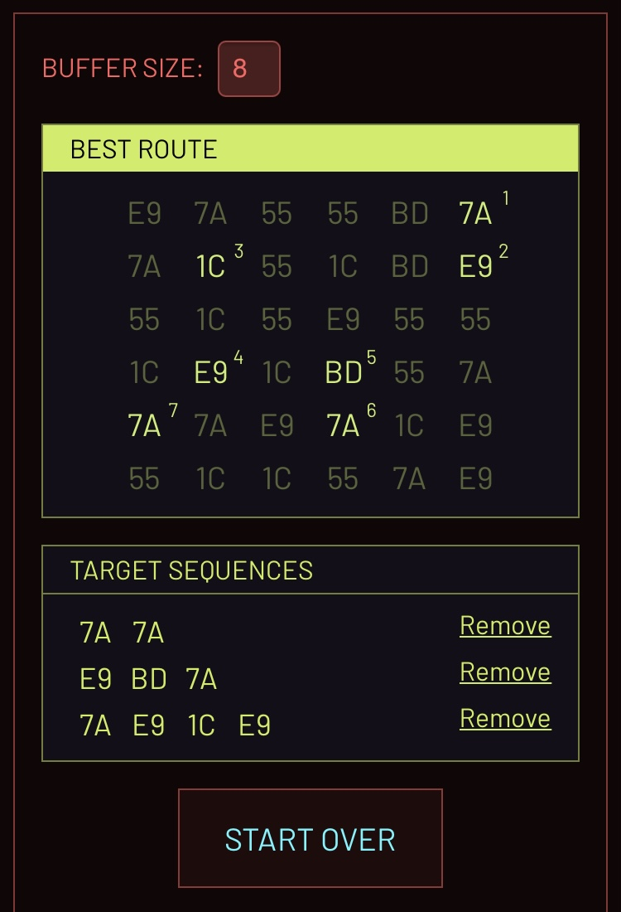

# OPTICAL BREACHER

An online Cyberpunk 2077 breach protocol minigame solver using camera + OCR

Website: https://govizlora.github.io/optical-breacher

## Details
The puzzle solving algorithm is simply brute force. (Better ideas welcomed!)

The target sequences are weighted from top to bottom as this: `1`, `1.1`, `1.2`, ... So it will focus on more hit first, and when even, the lower sequences will have higher priority.

The OCR part took the most time. I initailly used the default English OCR provided by tesseract, but it fails randomly (like recognizing "55" into "5") and the success rate is below 50%. Eventually I trained the model by myself, using tesstrain. Instead of recognizing single English characters, I let the program treat the byte as a whole, so the computer actually think "55" or "1C" as a single character in a mysterious language. The self-trained model worked better, but still not perfect. TBH I think maybe tesseract is not the best option, but since it's the only popular choice in JavaScript and I'm not famailiar with WASM, this will be the way to go for now.

## Local develop
Make sure you have `node` and `yarn` installed, then clone the repo and run `yarn start`.

## Screenshots

## Acknowledgement
- https://github.com/kyle-rader/breach for test data
- https://github.com/naptha/tesseract.js which made this web app possible
- https://github.com/tesseract-ocr/tesseract and https://github.com/tesseract-ocr/tesstrain tesstrain made training the model a lot easier
- My wife for providing machine learning advices
